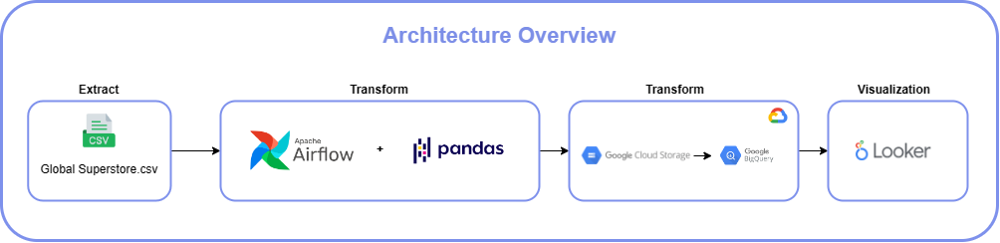
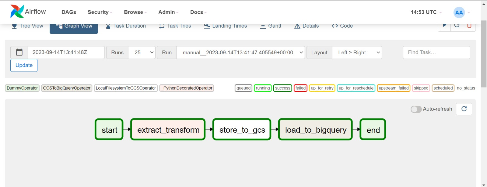
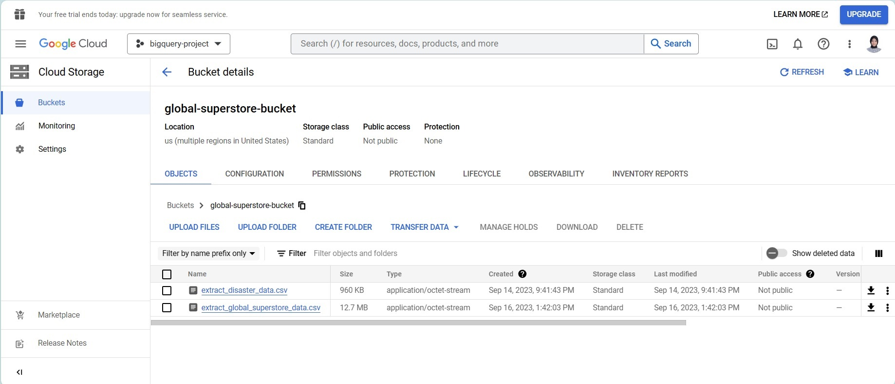
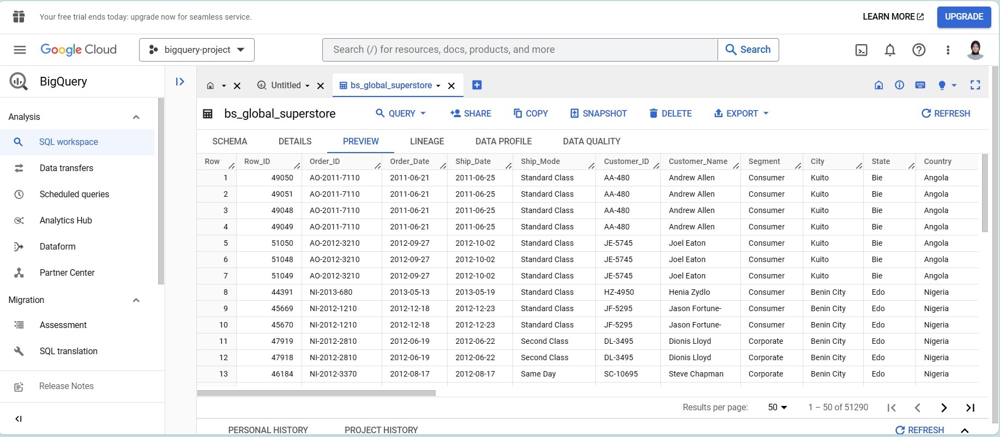
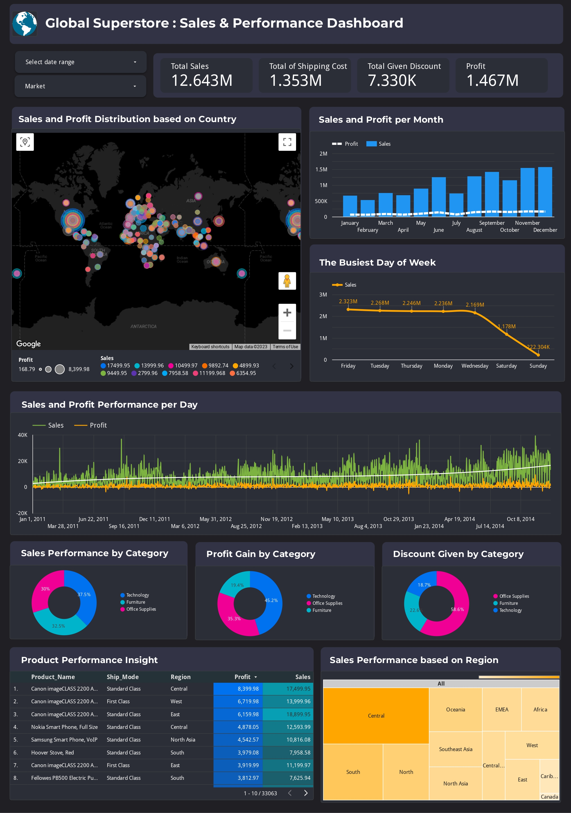

# Simple ETL with Airflow, Google Cloud Storage and BigQuery

## Overview
This project is an overview of a simple Extract, Transform, Load (ETL) process using Airflow, Google Cloud Storage, and BigQuery. At the end of the project, visualization is performed using Looker Studio, where data is gained from the data that has already been ingested into BigQuery.

## Data Sources
- Global Superstore.csv

## Tech Stacks
- Python (v3.8.5)
- Airflow (v2.0.2)
- Google Cloud Storage (GCS)
- BigQuery
- Looker Studio

## Architecture
The architecture for ETL begins with extracting data from the data source, which is then transformed using pandas, with orchestration processes managed using Airflow. After the transformation, the data will be ingested into Google Storage, and subsequently sent to Google BigQuery. After that, a visualization process is carried out using Looker Studio



## Transformation on Dags
- **Handling missing values**: Replacing missing data in the "Postal Code" column with the value "None."
- **Data type conversion**: Converting the data type of the "Order Date" and "Ship Date" columns to datetime.
- **Data extraction**: Extracting the year, month, and day from the "Order Date" column.
```python
 def extract_transform():
      df = pd.read_csv(f"{DATA_PATH}/global_superstore.csv")

      # Replace null in postal code column with 'None'
      df['Postal Code'].fillna('None', inplace=True)

      # Change Order Date and Ship Date as Datetime
      df['Order Date'] = pd.to_datetime(df['Order Date'])
      df['Ship Date'] = pd.to_datetime(df['Ship Date'])
        
      # Get order year, month, and day
      df['Order Year'] = df['Order Date'].dt.year
      df['Order Month'] = df['Order Date'].dt.strftime('%B')
      df['Order Day'] = df['Order Date'].dt.strftime('%A')

      df.to_csv(OUT_PATH, index=False, header=False)
```


## ETL Result
### a. Orchestration Result in Airflow
Here are the results of orchestrating with Airflow on the previously created DAGs.



### b. Ingested Data in Google Cloud Bucket & Bigquery

When the data is successfully ingested into Google Cloud Storage, both the data sources and the transformed data will appear as CSV files inside the Google Cloud Storage bucket.


After entering the bucket, the data will be sent to BigQuery. Here is a preview of the data that has already been ingested into BigQuery.



## Visualization
Here is the visualization dashboard for Profit and Sales Performance using Looker Studio. 
- The visualization link can be accessed at the following link: [Sales and Performance Dashboard](https://lookerstudio.google.com/reporting/0fcb01e5-3767-416c-9f3d-ec8b2963969e)





